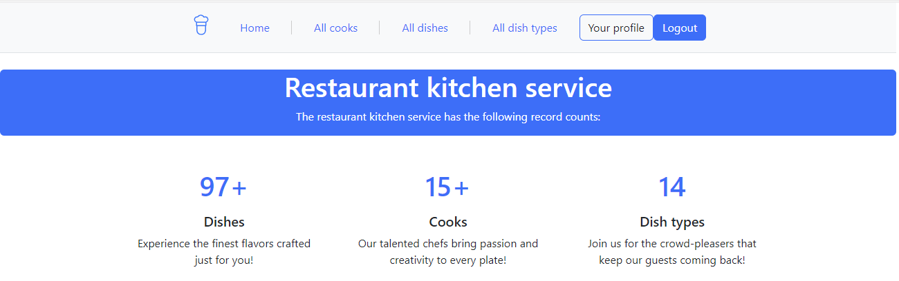

# Restaurant kitchen service 👨‍🍳

## Overview
This project is a kitchen management system where users can manage cooks, dishes, and dish types. Users can explore a list of available dishes, see details about each dish, and view which cooks are associated with each one. Cooks can also be assigned or unassigned to dishes. The application includes search functionality, allowing users to find cooks by last name.

Other developers can easily extend the project by adding features such as more detailed user roles (e.g., head chefs), new categories for dishes, or additional functionalities like dish ratings or ingredient tracking.

## [Click here to check out](https://restaurant-kitchen-service-cvp4.onrender.com/)
#### To log in into BUFET Website you can use:
Adm1n_Entry
####
sEcuRe_paSS
#### or
UsEr_enTrY
####
UseR_PaSs
## Installation
1. **Clone the repository:**

    ```bash
    git clone https://github.com/BastovOleksandr/restaurant-kitchen-service.git
    cd restaurant-kitchen-service
    ```

2. **Create a virtual environment (optional but recommended):**

    ```bash
    python -m venv venv
    ```

3. **Activate the virtual environment:**

    - On Windows:

        ```bash
        venv\Scripts\activate
        ```

    - On Unix or MacOS:

        ```bash
        source venv/bin/activate
        ```

4. **Install dependencies:**

    ```bash
    pip install -r requirements.txt
    ```

5. **Apply migrations:**

    ```bash
    python manage.py migrate
    ```

6. **Fill the database with prepared fixtures (you can skip the next step after this and use the previously mentioned credentials):**

    ```bash
    python manage.py loaddata fixture.json
    ```

7. **Create a superuser account:**

    ```bash
    python manage.py createsuperuser
    ```
   
## You are ready to go! Just check out last step. But if you want more config

8. **If you plan to run the project locally with DEBUG=False in the ".env" file**

    ```bash
    python manage.py collectstatic
    ```

9. **You can rename "env.sample" to ".env" and use it to configure your database settings. More info inside the file**

    ```bash
   DB_ENGINE          # Database engine
   DB_HOST            # Database host
   DB_NAME            # Name of the database
   DB_USER            # Username for database connection
   DB_PASSWORD        # Password for database connection
   DJANGO_SECRET_KEY  # For security, must be unique and secret
   USE_DEFAULT_DB     # Use built-in sqlite3 local database in projects root dir
   DJANGO_DEBUG       # Django debug mode
    ```

10. **Run server:**

    ```bash
    python manage.py runserver
    ```

11. **Access the application in your web browser at [http://127.0.0.1:8000/](http://127.0.0.1:8000/)**

### How to use

- Explore the Dishes: Browse through the list of dishes to see all available options. Click on a dish to view more details
- Search for Cooks: Use the search bar to find cooks by their last name
- View Cook Profiles: Each cook has a profile showing their details and the dishes they are assigned to
- Assign/Unassign Cooks to Dishes: As a logged-in user, you can assign or unassign cooks to specific dishes
- Manage Dishes and Cooks: If you have the proper permissions, you can add, edit, or remove dishes and cook profiles

### Demo


